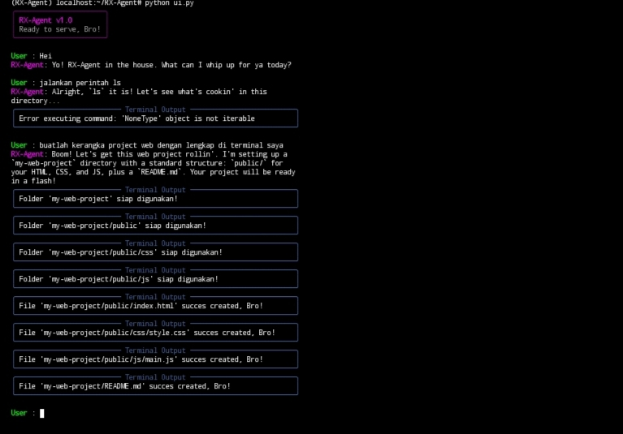

# 🤖 RX-Agent

<p align="center">
  
</p>

<p align="center">
  
  
  
</p>

---

## 🚀 About RX-Agent
**RX-Agent** is an intelligent AI agent that is not just a chat assistant,  
but can execute tasks directly from the terminal.

---

## 🧠 Powered By
- Python 3.12.12
- Gemini API

---

## 🖼️ Preview
<p align="center">
  
</p>

---

## ⚙️ Installation

### 🐧 Linux / MacOS
```bash
pip install -r requirements.txt
chmod +x start.sh
./start.sh
```

### 🪟 Windows
```bash
pip install -r requirements.txt
python main.py
```


# For your contribution, you can add new features or fix existing bugs.
